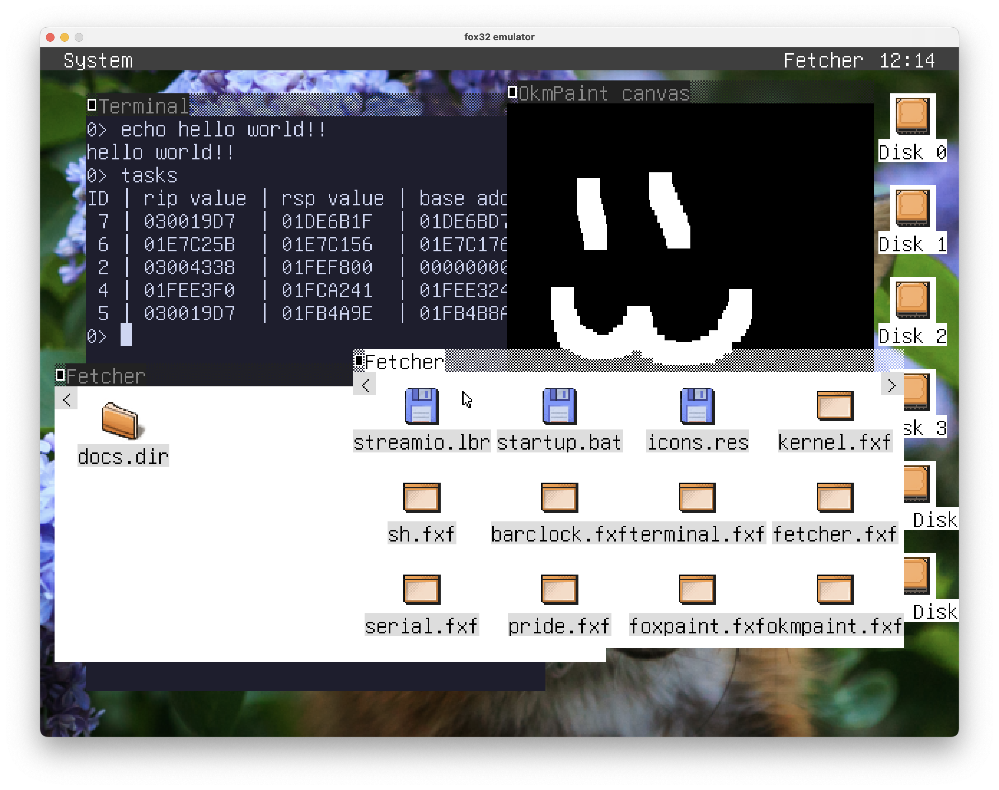

# fox32os

**fox32os** is the main operating system for **fox32**. It runs on top of **fox32rom** and allows the use of relocatable FXF binaries, cooperative multitasking, filesystem access, memory allocation, and window management.

## Getting Started

Prebuilt images of the latest commit are available on the [GitHub Actions page](https://github.com/fox32-arch/fox32os/actions).

Releases available on the [Releases page](https://github.com/fox32-arch/fox32os/releases) are **very outdated** at the moment and should not be used.

### Building

- Download [tools](https://github.com/fox32-arch/tools) and [fox32asm](https://github.com/fox32-arch/fox32asm).
  Either use the pre-built binaries or build them.
- Run `make`

### Application Development

Documentation of the fox32os APIs is currently a work-in-progress. See the [docs/api directory](docs/api/) for information.

## License
This project is licensed under the [MIT license](LICENSE).
